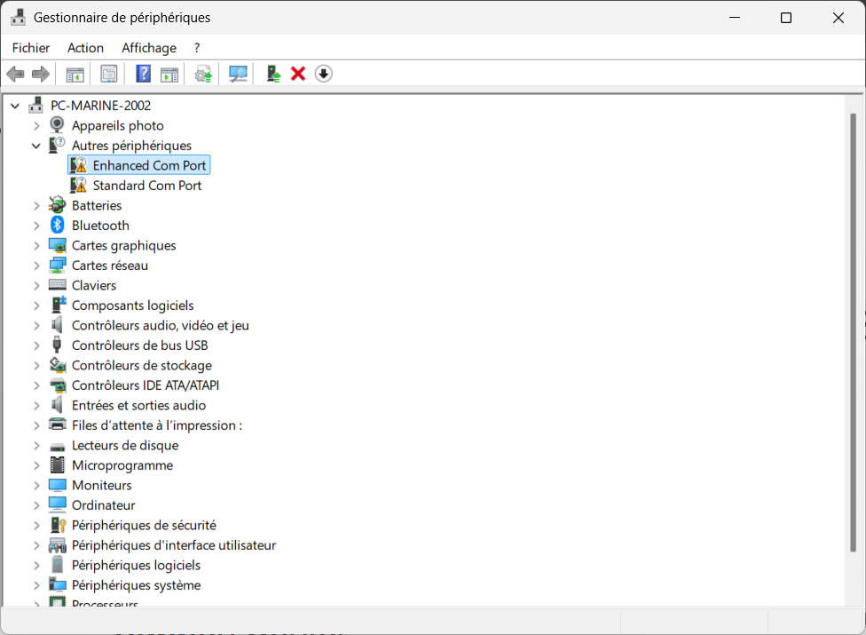
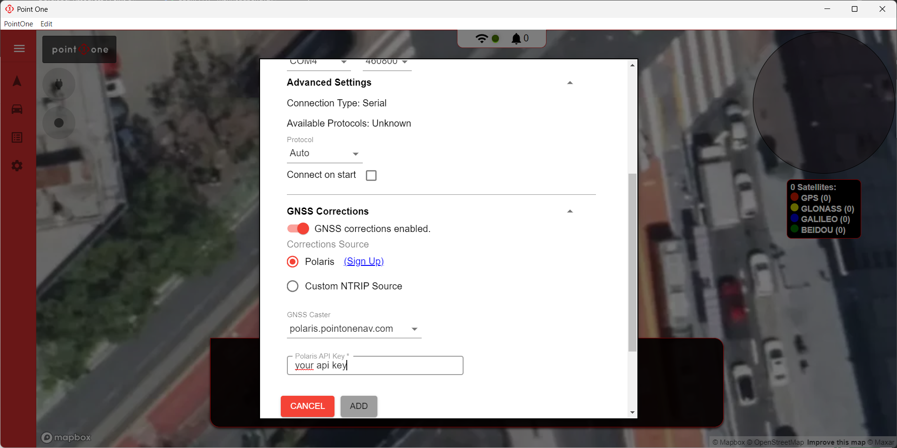
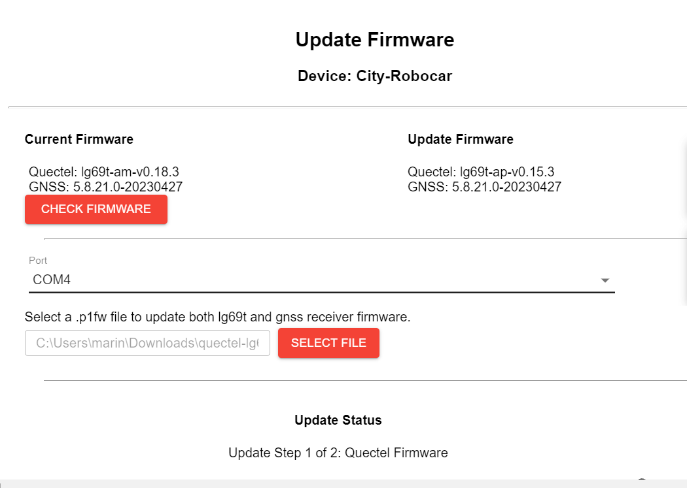
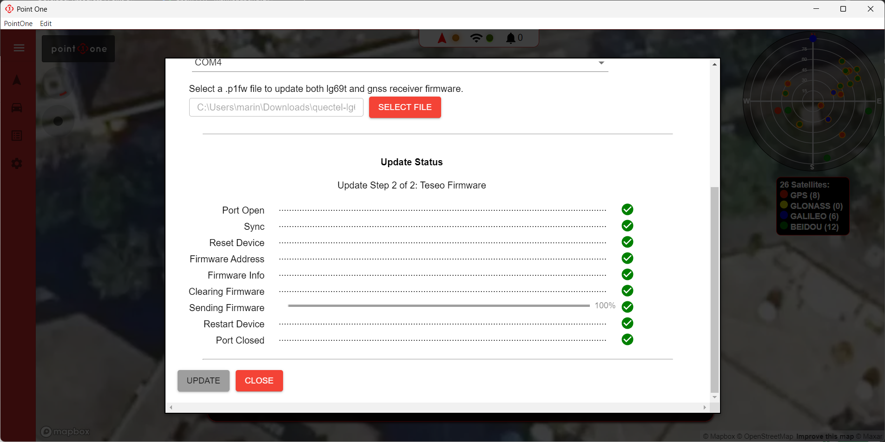

## 1. Introduction {#introduction}

The Point One Navigation Standard Development Kit is a high-precision GNSS-based positioning system designed for real-time kinematic (RTK) applications. It provides centimeter-level location accuracy and is ideal for integration into autonomous systems such as robotic cars, drones, or research platforms.

This development kit includes both **GNSS** (Global Navigation Satellite System) and an onboard **IMU** (Inertial Measurement Unit), allowing for reliable and stable positioning even in environments where satellite signals may temporarily degrade — such as tunnels or near large structures.

The GNSS module delivers global position data using satellite constellations like GPS, GLONASS, and Galileo, while the IMU provides orientation, acceleration, and angular velocity data that enhance accuracy and robustness in dynamic or partially obstructed conditions.

Proper setup, flashing, and calibration of the firmware are essential to ensure that your device is fully recognized and ready for software integration and sensor fusion in high-accuracy navigation tasks.

## 2. Requirements {#requirements}

To follow this tutorial, you will need:

- A Windows computer
- The Point One Navigation Standard Dev Kit
- A micro-USB cable (usually provided in the kit)

Additionally, please install the following software on your computer:

1. **USB Serial Driver** – Enables your PC to recognize the connected GNSS module
   📥 [Download USB Driver for Windows](https://s3.amazonaws.com/files.pointonenav.com/drivers/CP210x_Universal_Windows_Driver.zip)

2. **Point One Desktop** – Used for updating firmware and configuring the module
   📥 [Download Point One Desktop for Windows](https://s3.us-west-2.amazonaws.com/updates.pointonenav.com/eos/win32/x64/PointOne-1.6.10.Setup.exe)

3. **Firmware File** – Latest firmware for the Standard Dev Kit
   📥 [Download Firmware](https://s3.amazonaws.com/files.pointonenav.com/quectel/lg69t/quectel-lg69t-ap.0.15.3.p1fw)

> 💡 For additional documentation and tools, check the official Point One resource portal:
> [https://pointonenav.com/resources/](https://pointonenav.com/resources/)

## 3. Flashing Tutorial {#flashing}

Follow these steps to set up your device correctly.

### A. Install USB Serial Driver {#install-driver}

1. **Download the USB Driver**
   📥 [Download USB Driver (Windows)](https://s3.amazonaws.com/files.pointonenav.com/drivers/CP210x_Universal_Windows_Driver.zip)

2. **Extract the ZIP Archive**
   - Right-click the downloaded ZIP file and choose **Extract All**.
   - Remember the folder location (you’ll need it in the next step).

3. **Connect the GNSS Dev Kit**
   Use a micro-USB cable to connect your Standard Dev Kit to the computer.

4. **Open Device Manager**
   - Press `Windows + X` → select **Device Manager**
   - Under **Other devices (Autres périphériques)**, you’ll likely see:
     - ❗ **Enhanced Com Port**
     - ❗ **Standard Com Port**
     with yellow warning icons — this means Windows doesn't recognize the device yet.

Here’s what you’ll typically see before installing the driver:

5. **Manually Install the Driver**
   - Right-click on **Enhanced Com Port**
   - Select **Update driver**
   - Choose **Browse my computer for drivers**
   - Navigate to the folder where you extracted the driver ZIP file
   - Click **Next** to install
   - Repeat the same for **Standard Com Port**

6. **Verify Successful Installation**
   After installation, the devices will appear under **Ports (COM & LPT)**, recognized as:
   - `Silicon Labs CP210x USB to UART Bridge (COMX)`

### B. Launch Point One Desktop & Configure GNSS Connection {#flashing-utility}

Once the USB driver is installed and your device is recognized, you can begin configuring your GNSS module using the **Point One Desktop** software.

#### 1. Launch Point One Desktop
- Open the application: `PointOne` → the GUI should launch with a satellite map view and a left-hand settings menu.

#### 2. Select the Serial Port
- Under **Connection Settings**, select the appropriate serial port (e.g., `COM3`, `COM4`, etc.) that corresponds to your GNSS module.
- Set the baud rate to `460800` (or leave at default if you're unsure).
- Protocol: leave as `Auto`
- Check the **"Connect on Start"** box if you want the software to auto-connect next time.

#### 3. Configure GNSS Corrections
- Scroll down to **GNSS Corrections**
- Choose:
  - ✅ **Polaris** as the correction source
  - 🔒 **GNSS Caster**: `polaris.pointonenav.com`
  - 🔑 **Polaris API Key**: enter the API key provided to you or the one from your point account.

Here’s what the configuration should look like once completed:

Once everything is configured, click **ADD** to save the GNSS connection.

You are now ready to move forward with firmware flashing or device integration.

### C. Update the GNSS Firmware {#firmware-update}

Once the device is connected via USB and Point One Desktop is configured, you can now update your GNSS module with the latest firmware.

#### 1. Open the Firmware Update Tab

- Click on the **gear icon** in the left sidebar of Point One Desktop.
- The software should automatically detect the connected device and display the **Current Firmware** and the recommended **Update Firmware** versions.
- Ensure the correct serial **Port** is selected (e.g., `COM4`).

#### 2. Load Firmware File

- You can download the last firmware version in the requirements.

- Click **SELECT FILE** and navigate to the downloaded `.p1fw` firmware file.

#### 3. Begin Firmware Update

- Click **CHECK FIRMWARE** if needed to refresh version info.
- Once the file is selected, the update will begin in two steps:
  1. Quectel Firmware
  2. GNSS Receiver Firmware

- Do **not** disconnect the USB or power during this process.

Here’s what the firmware update window looks like before starting:

After a successful update, you should see a confirmation like this:

Your GNSS module is now up-to-date and ready for RTK positioning with enhanced performance and stability.

## 4. Python Development {#python-dev}

*This section will describe how to interface with the Point One Navigation Dev Kit using Python (e.g. serial communication, parsing NMEA or custom messages, etc.).*

## ✅ Notes

- Ensure the device is on a flat, unobstructed surface when testing GPS lock.
- Some installations (especially on Windows) may require rebooting after driver installation.
- Avoid powering down the device during firmware flashing.

For issues or improvements, open a GitHub issue or submit a pull request. Please attach logs, error messages, or screenshots to help debug efficiently.
