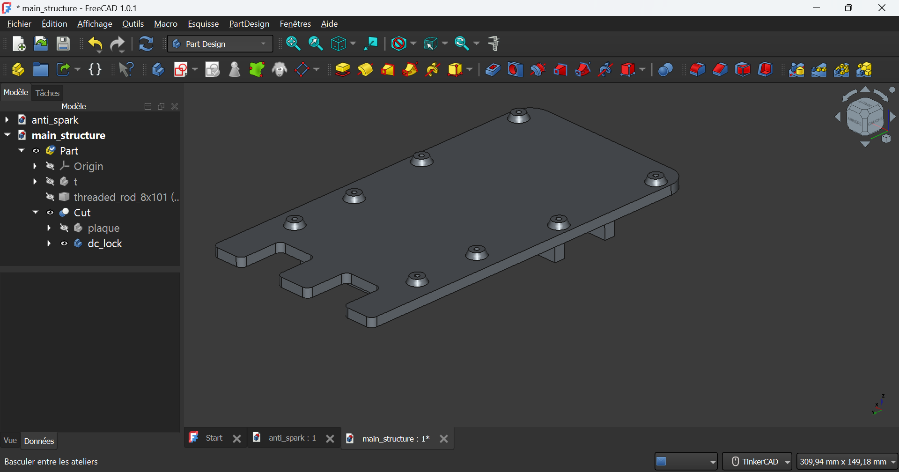
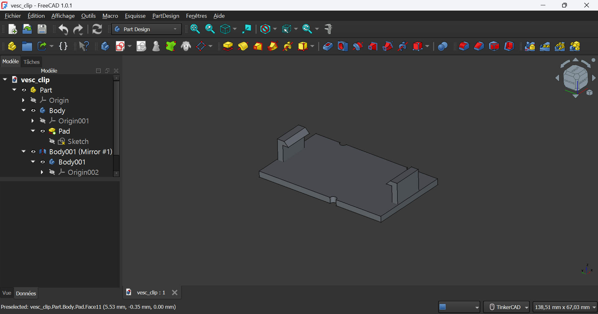

## Introduction

This page presents the different 3D-printed parts used in this project, along with recommendations for printing settings and their role in the overall setup.

3D printing is essential here to create custom, durable, and precise components that can’t easily be sourced off the shelf.  
The parts are modeled using <b>FreeCAD</b>, a free and open-source parametric 3D modeler. Once designed, they are prepared for printing with <b>PrusaSlicer</b>, which slices the models into layers and generates the G-code used by the 3D printer.

## Parts List

<deflist collapsible="true">

<def title="Main Mount" default-state="collapsed">
This part supports the Jetson Nano, the DC converter, and later the GPS RTK module.  
It features two bars that slot into the original RC car frame to reinforce the chassis. Each bar has a hole for a screw, allowing it to be fixed securely together with the “T” piece for extra stability.  
Two additional holes at the rear align with the car’s back mounting points.

<b>Printing recommendation:</b> Print with the front edge facing down to strengthen the junction between the bars and the base plate, which can otherwise be weak.

<tr>
<td></td>
</tr>
</def>

<def title="VESC Clip" default-state="collapsed">
This part holds the VESC securely in place. It features clips for easy installation and removal.

<b>Printing recommendation:</b> Print on one of the long side edges to avoid weak clip joints.

<tr>
<td></td>
</tr>
</def>

<def title="Anti-Spark Clip" default-state="collapsed">
This part stabilizes the anti-spark connector.  
Although called “clips,” these act more like retainers — the part is slid underneath them rather than snapped in.

<b>Printing recommendation:</b> Print on one of the long side edges to keep the clip structure strong.

<tr>
<td></td>
</tr>
</def>

<def title="Battery Box" default-state="collapsed">
This box secures the battery. Two rear legs fit into existing holes in the RC car chassis to prevent movement.

<b>Printing recommendation:</b> Print diagonally (see reference image at the end) to reduce the need for supports — especially inside the box.

<tr>
<td></td>
</tr>
</def>

<def title="Camera Support" default-state="collapsed">
This mount holds the camera and features several detailed sections.  
The legs slot into the car’s existing holes and each has a central screw hole for fixing.  
The camera housing includes two rear screw holes for mounting the camera and vertical ventilation slots for airflow.

<b>Printing recommendation:</b> Print with the legs positioned horizontally to ensure strong joints between the legs and the body.

<tr>
<td></td>
</tr>
</def>

</deflist>

## Printing Layout

Everything should fit into your 3D printer as shown below:

<td></td>

<b>Recommended print settings:</b>
- **Material:** PLA  
- **Infill:** ≥ 20% for strength  
- **Supports:** Enabled everywhere

## Contributing

If you’d like to suggest improvements, new part designs, or fixes, please [create an issue](#) or submit a pull request.

Thank you for helping improve the project!