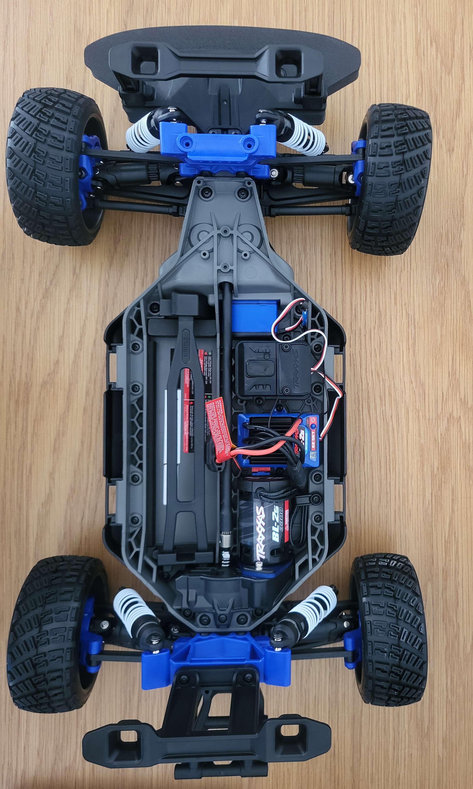
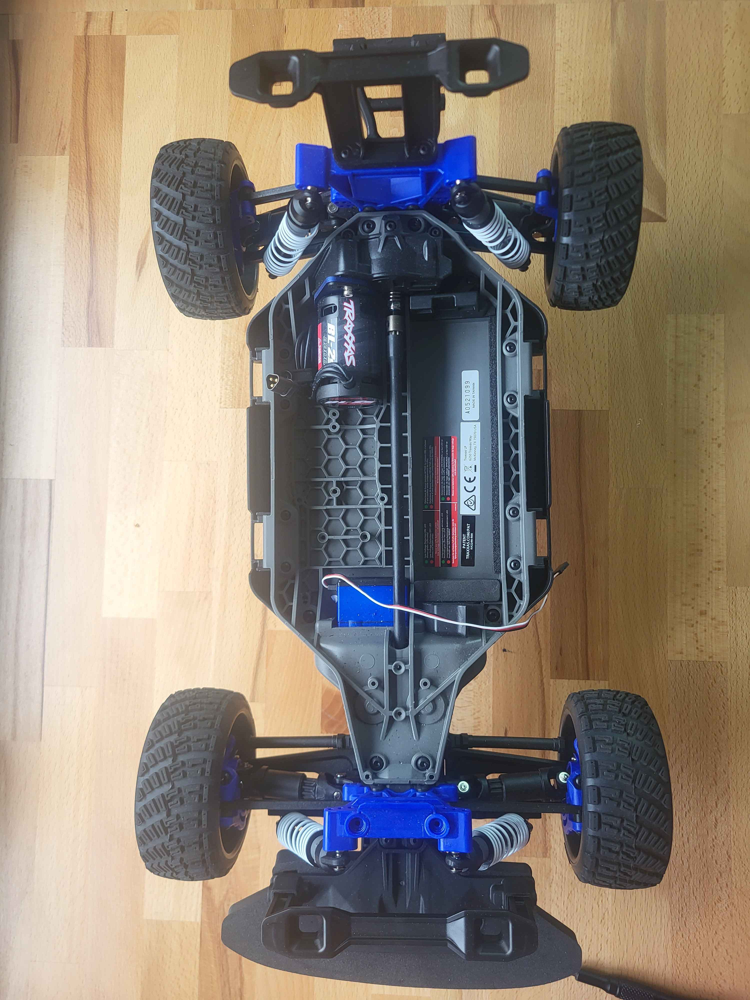
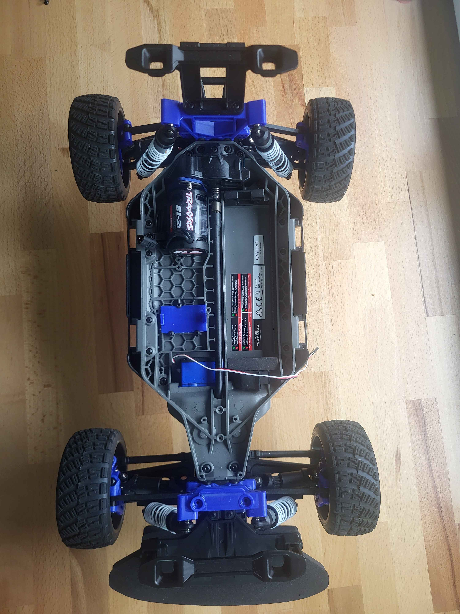
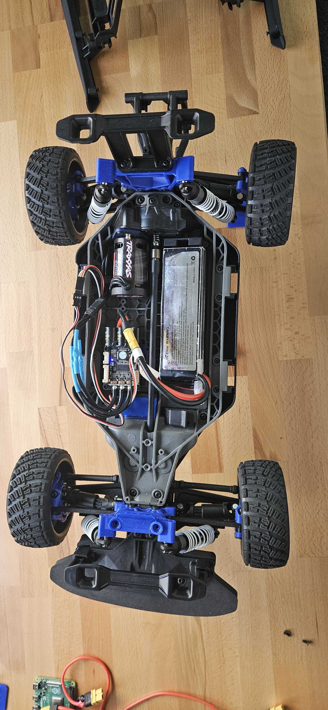
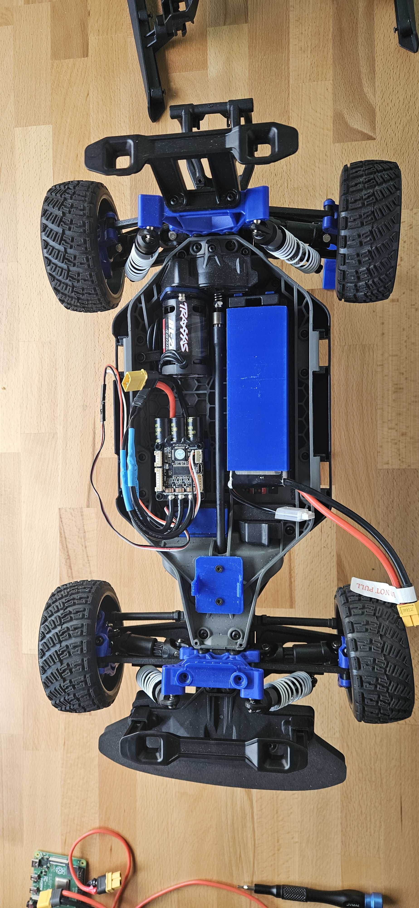
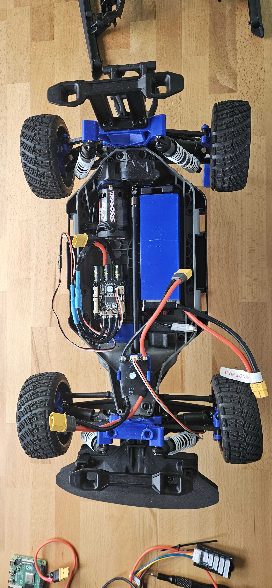
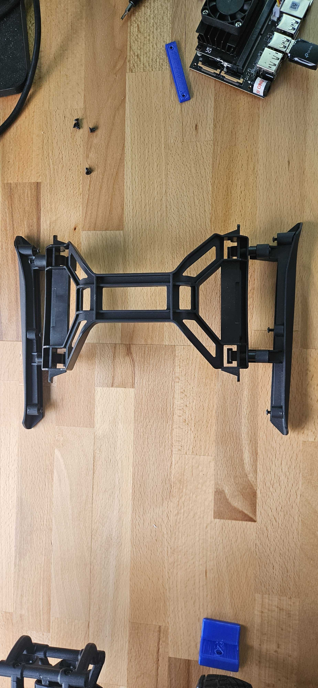
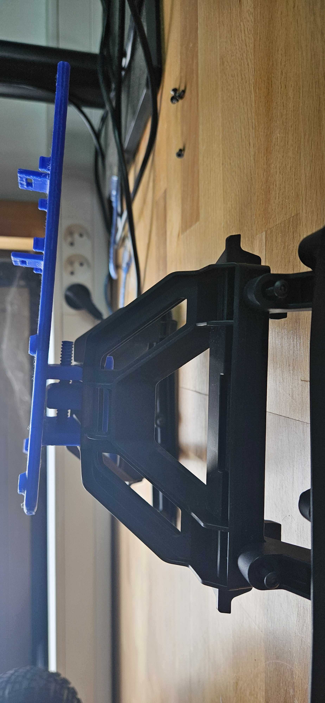
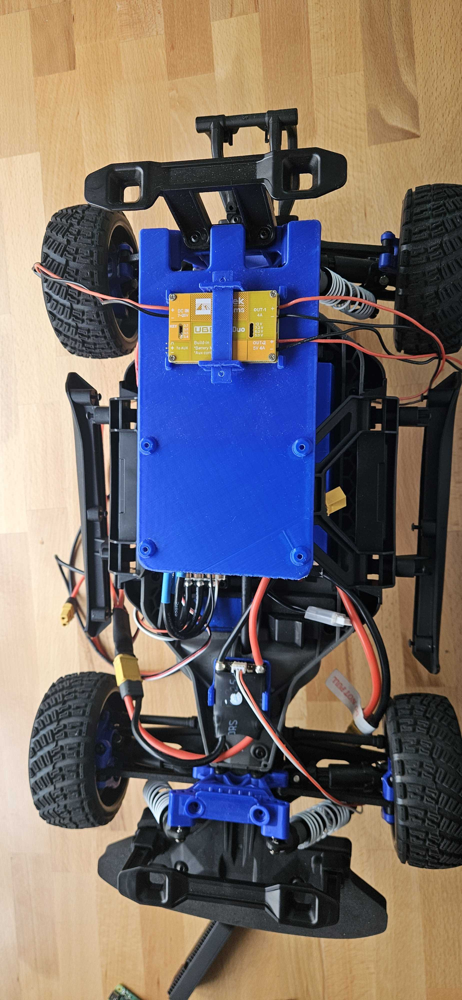
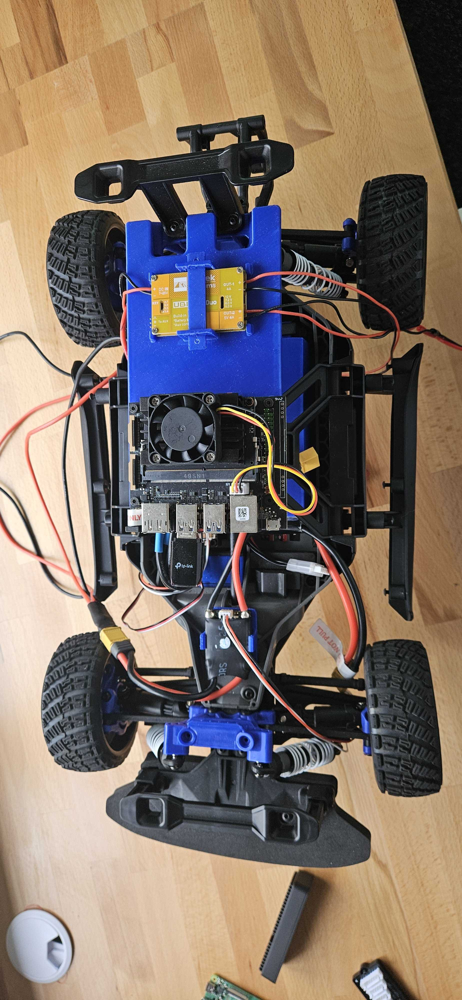

## Tools Required

- Precision screwdriver set  
- Wire stripper  
- Soldering iron  
- Cutting pliers  
- Flat pliers  
- M3 tap (for threading 3 mm screw holes)

## Removing RC Control Components

Before building your Robocar, you must remove the original RC control system — typically the receiver and electronic speed controller (ESC) — to make space for the onboard AI electronics and motor controller (VESC).

**⚠️ Important:** Make sure the car is powered off and the battery is disconnected before starting.

### Step 1: Remove the Top Shell

1. Unscrew the four body clips that secure the plastic shell to the chassis.
2. Carefully lift the shell and set it aside. It will be reused.

### Step 2: Detach the Rear Wing and Mounts

1. Use a screwdriver to remove the rear wing and its plastic mounting brackets.
2. Keep the screws; some may be reused for mounting new components.

> Below is a photo of the car **with the plastic shell removed**, exposing the inner chassis:

### Step 3: Unplug and Remove the RC Receiver and ESC

1. Locate the RC receiver and the ESC (often mounted in plastic holders or boxes).
2. Carefully unplug all connectors: battery input, motor wires, and servo plug.
3. Unscrew or unclip the receiver and ESC from the chassis.
4. Set them aside. They will be replaced by the Jetson Nano and VESC modules.

> After removing these components, you should see an **empty central frame** like in the image below — ready to receive custom mounts and electronics:

## Install the VESC Module

Now that the original electronics have been removed, it's time to mount the VESC (motor controller) using its custom 3D-printed support.

1. Place the 3D-printed VESC support clip into the central area of the chassis, where the original ESC was located.

> Below is a photo of the car **with the 3D-printed VESC support installed**, ready to receive the controller:

2. Secure the support to the chassis using M3 screws or zip ties through the dedicated holes.

3. Carefully insert the VESC module into the 3D-printed clip until it clicks or fits snugly.

4. Plug the motor wires into the VESC (keep track of wire order for later calibration).

5. Leave the power input and servo signal cables accessible — they will be connected later to the Jetson Nano and power source.

> Below is a photo of the car **with the VESC mounted and fully connected** (motor, servo, and power wires visible):

To continue, you now need to flash and configure the VESC for use with your Robocar.  
➡️ Please refer to the [VESC Setup section](../vesc-calibration/) for detailed instructions.

## Install the Battery Case

Now that the motor controller is installed, let’s mount the **custom 3D-printed battery box** to securely hold the power source.

1. **Position the battery box** in the right area of the chassis, aligning the rear legs of the box with the mounting holes.

2. **Insert the battery** and check that it fits snugly. Ensure cables are routed cleanly to avoid stress or entanglement.

> Below is an image showing the battery box fully installed with a battery inside, alongside the mounted VESC:

## Install the Anti spark module

To keep your wiring clean and your XT60 anti-spark connector secure, we use a dedicated 3D-printed case that holds it in place at the front of the chassis. This avoids stress on the cables and improves overall robustness.

> Below is a photo of the chassis **before mounting** the anti-spark connector. You can see the available flat area just behind the front bumper:

1. **Position the anti-spark case**  
   Place the 3D-printed case into the flat area between the front suspension and the steering servo. The mounting holes should align with the two small vertical holes in the plastic frame.

2. **Insert the XT90 anti-spark connector**  
   Slide the XT90 connector into the mount from the top. It should sit snugly and allow access for connection/disconnection during battery changes.

3. **Secure the mount**
   Use two M3 screws to fasten the anti-spark mount to the chassis. If needed, pre-thread the holes with an M3 tap.

4. **Route the cables**
   Neatly route the power cables back toward the VESC and battery. Keep them clear of moving suspension parts.

> Below is a photo of the anti-spark connector mounted securely in place:

## Install plates on car support

We now proceed to mount the rear support plate that will host additional components such as the Jetson Nano and DC converter. This platform is fixed to the existing rear plastic frame of the car using dedicated 3D-printed parts.

> Below is a photo of the original rear mount **before** adding the 3D-printed plate. You can clearly see the open area in the middle and the side brackets that will be used to screw the support.

### Mount the 3D-Printed Support Plate

1. Take the 3D-printed plate and align its side hooks and screw holes with the rear plastic chassis structure.
2. Clip the front tabs into place and gently push the rear edge down until it snaps in securely.
3. Insert printed screws in the corner holes and tighten to ensure the platform stays firmly mounted.

> The side view below shows how the support plate fits flush with the existing frame and locks into position.

> Here’s the final top view with the full plate securely installed and ready for Jetson and DC converter:

> Below is a photo of the car **with the DC converter mounted on the plate**, wired and centered:

4. Use the printed stick to fix the dc converter like on the picture.

> Below is a photo of the full setup with the Jetson Nano installed and wired:

5. Align the Jetson Nano holes with the support columns on the plate.
6. Secure it using M3 screws.