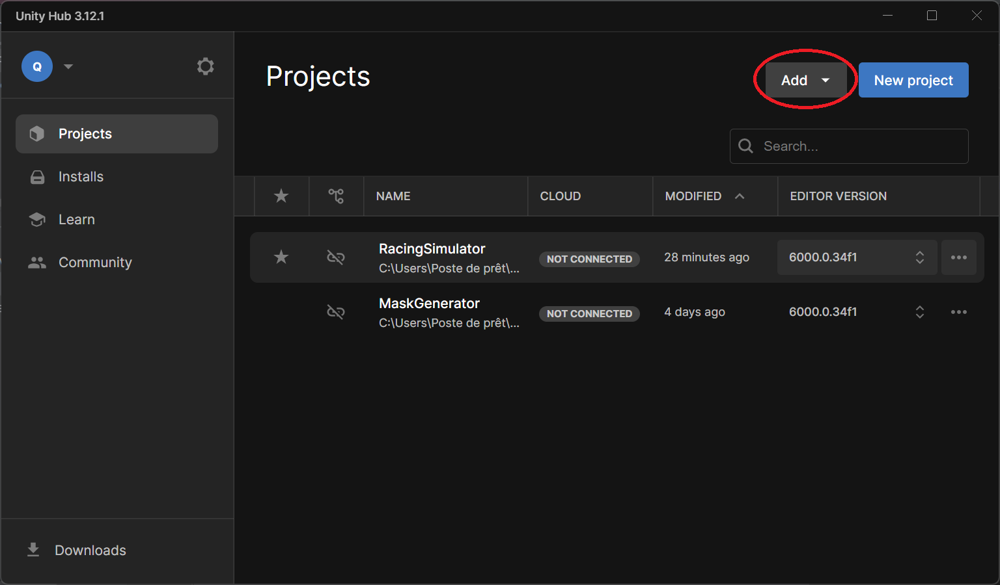
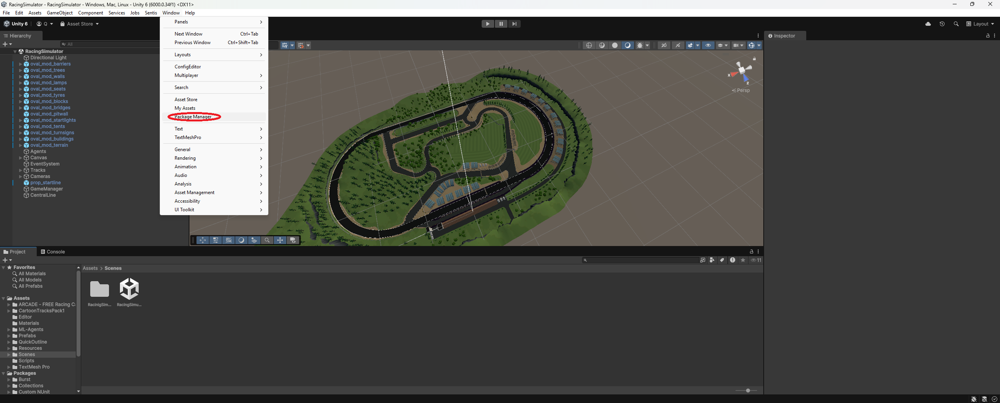

# Tutorial

> **Note**: This tutorial assumes you have some basic knowledge of Unity.  
> It **does not** explain how to use Unity from scratch, and may be challenging for complete beginners.  
> While the tutorial involves Unity ML-Agents, it focuses solely on scripting. If you're looking to use Unity's AI config files, please refer to other resources.

## In this tutorial, you will learn how to:

- Use the simulation as-is
- Customize the simulation

## Before You Start

Make sure the following prerequisites are met:

- Unity Hub is installed (you can download it [here](https://unity.com/download))
- The **RacingSimulator** Unity project folder is accessible and fully unzipped
- You have a stable internet connection

## Part 1: Open the Project

In this section, we'll guide you through opening the project in Unity Editor and installing required packages.

1. Open Unity Hub and **Add the project from disk**  
   
2. Install the required Unity Editor version if prompted
3. Open the project
4. Load the scene:  
   
   - Go to the **Assets** folder in the **Project** tab
   - Open the **Scenes** folder
   - Double-click on `RacingSimulator.unity`
5. Install required packages via the **Package Manager**  
   
6. Ensure the following packages are installed:
   - `com.unity.ugui` (Unity UI)
   - `com.unity.ml-agents` (ML Agents)

If everything is set up correctly, you should now be able to run the simulation using the **Play** button.

> **Tip**: If you cloned the project and textures are missing, you may need to use [Git LFS](https://git-lfs.com/)

## Part 2: Project Overview

This section provides an overview of the project components and their roles.

<deflist collapsible="true">

<def title="Decor" default-state="collapsed">
The <b>Decor</b> is composed of various static environmental elements.  

</def>

<def title="Tracks" default-state="collapsed">
The <b>Tracks</b> GameObject contains all the available tracks.  
To add a new track, place it under this object.  
Each track includes lines (available as prefabs):

- An inactive original line from the package
- A `LineRenderer` generated from the original line

The `LineRenderer` enables access to exact positions and automatically generates colliders using the **Line Renderer Collider Generator** script.
</def>

<def title="Agents" default-state="collapsed">
The <b>Agents</b> GameObject is initially empty. At runtime, it is populated by the **ConfigLoader** based on a config file.  
It instantiates `AgentCar Continuous` prefabs, each with:

- Car body and wheels (mesh and collider)
- First-person and third-person cameras
- A masking plane for isolating white lines
- A UI for displaying the first-person view

The prefab can be modified, especially the **Behavior Parameters** and **Car Continuous Controller** components.  
Empty fields are initialized at runtime from the config.
</def>

<def title="UI" default-state="collapsed">
Located under the <b>Canvas</b> GameObject, the UI includes the following components inside the "OpenPanel":

1. **ViewDropDown** – switches the camera view
2. **TrackDropDown** – selects the active track
3. **TrackBestScore** – displays the best lap score (`-1:-1` if none exists)
4. **Decor** – toggles decor visibility; use the "Decors To Deactivate" field in the **Decor Button** script
5. **RaycastVisionage** – toggles visibility of raycasts
</def>

<def title="Game Manager" default-state="collapsed">
This object handles core project logic via:

- **Config Loader** – loads the config file, instantiates agents, and wires everything up
- **Raycast** – performs 2D raycasting and links it to the corresponding UI control
</def>

<def title="Central Line" default-state="collapsed">
A <b>Central Line</b> is generated when selecting a track.  
It includes colliders used to:

- Track the agent's progress along the track
- Provide reward metrics for reinforcement learning (e.g., distance from center, randomized start position)
</def>

<def title="Cameras" default-state="collapsed">
This GameObject contains all cameras not embedded in car prefabs.  
Any camera placed here becomes available in the **ViewDropDown**.
</def>

<def title="Event System" default-state="collapsed">
Used to enable heuristic (manual) control of agents via Unity Input.  
This mode does not require Python or external scripts.
</def>

</deflist>

## Part 3: Code Documentation

For more in-depth information about the codebase, please refer to the project’s internal documentation.

## Part 4: Build the Project

To create a build:

1. Go to **File → Build Settings**
2. Choose your operating system
3. Ensure the correct scene is added to the **Scenes In Build** list
4. Click **Build**

> **Note**: You can connect a Python script directly to the Unity Editor, but it's generally less convenient than using a built version.

## Contributing

If you encounter any problems while using this project, feel free to [create an issue](#) to let us know.

We also welcome contributions!  
You can submit a pull request if you'd like to:

- Fix a bug
- Improve the documentation
- Add a new feature

Thanks for helping make this project better!package_manager_unity.png)
6. Ensure the following packages a