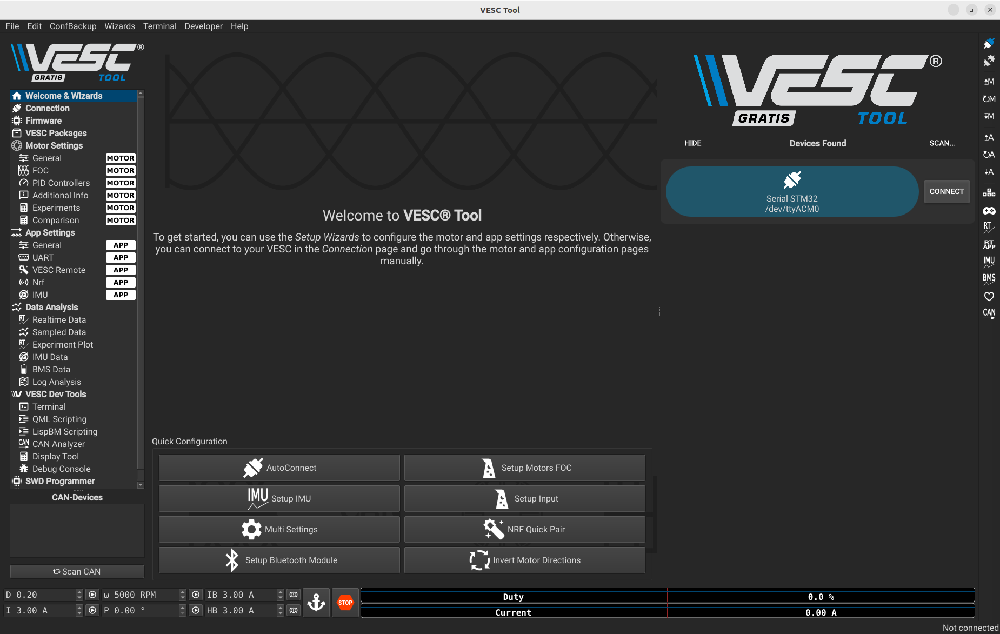
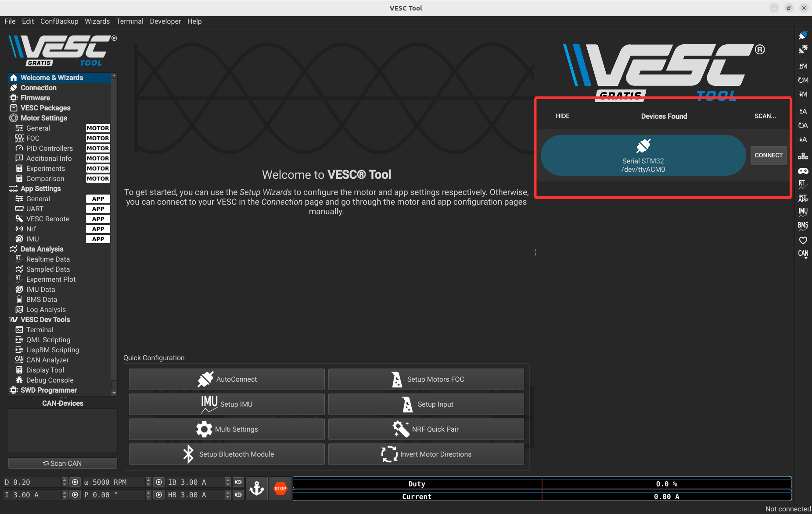
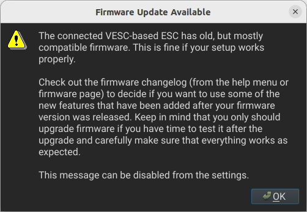
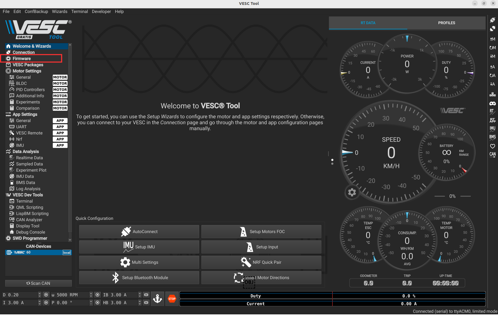
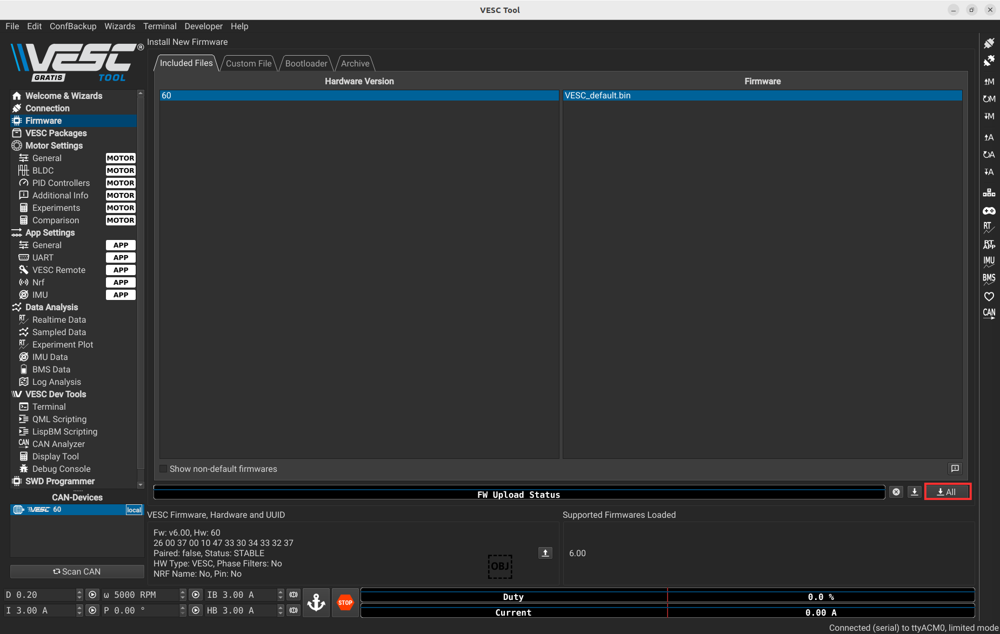
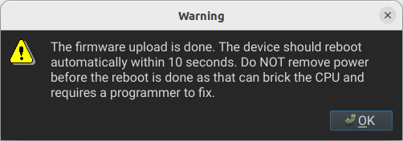

# Robocar: VESC Calibration

**An educational and research-ready platform for autonomous navigation**

---

## 1. Introduction {#introduction}

The VESC (Vedder Electronic Speed Controller) is an open-source motor controller for electric vehicles and robotics. Calibration ensures precise sensor readings, smooth motor performance, and system optimization.

---

## 2. Required Tools and Software {#tools}

- The VESC included in your educational kit  
- A micro-USB cable  
- A computer (Windows, macOS, or Linux)  
- The VESC Tool (free version available at [https://vesc-project.com/](https://vesc-project.com/))

---

## 3. Configuration {#configuration}

#### A. Hardware Setup {#hardware}

1. **Power Connection**  
   Connect the VESC to the 4S LiPo battery provided in the kit using the XT60 (or compatible) connector. Double-check polarity before connecting to avoid damage.

2. **Motor Connection**  
   Connect the BLDC motor (already mounted on the Traxxas chassis) to the three-phase output wires of the VESC. The order of these wires doesn’t matter initially; it can be corrected later via motor detection.

3. **Servo Motor Connection**  
   Plug the servo motor into the PWM output of the VESC.

4. **USB Connection**  
   Use the provided USB cable to connect the VESC to your laptop. This connection allows you to configure and flash the VESC using the VESC Tool.

**Diagram:**

---

#### B. VESC Tool Setup {#vesc-tool}

1. **Open the VESC Tool**  
   Locate and open the VESC Tool software you installed earlier on your computer with hardware setup connected to your laptop.  
   When you first open the VESC Tool, you will be prompted to accept the Terms and Conditions (CGU). Make sure to read and accept them to proceed to the main interface.

**Screenshot:**

2. **Connect to the Listed VESC Device**  
   Once the VESC Tool is open, select your VESC device from the list to establish a connection. This allows the software to communicate directly with your hardware for flashing and configuration.  

   > **Note for Linux users:** You may need to add your user to the `dialout` group to enable USB access. The VESC Tool may prompt you to enter your password, and a system restart is required for the changes to take effect.

**Screenshot:**

If a firmware update is available, a pop-up like the one below will appear.

**Screenshot:**

---

### 3. Firmware Update {#firmware}

This step is optional and only needed if the firmware update message appears during connection.

Click the icons shown below to open the Firmware Manager window.

**Screenshot:**

Here is what you will see after clicking on the firmware icon.

**Screenshot:**

To update the firmware, you have to press the following button,

Then press Yes.  

After waiting a few minutes, this message will appear, and your new firmware will be uploaded.

**Screenshot:**

---

### 4. Motor Setup {#motor-setup}

The next step is to setup the motor. You have to go back to the main page and connect to the VESC again, because the firmware update restarts the VESC.

To setup the motor, you need to press the following button.

**Screenshot:**

Then press Yes.  
Then Next.

**Screenshot:**

Select the **third option**.  
Then fill in the relevant information about your battery. Below are the details for the battery included in the kit.

**Screenshot:**

Once you validate the battery info, you will see this pop-up. You can press OK if you entered the correct information.

Enter the motor information as shown below.  
> ⚠️ Before continuing, make sure the car is placed on the provided stand and that the wheels are not touching the ground or any obstacles. The motor will spin during the process.

**Screenshot:**

After 30 seconds this message will appear saying the motor successfully spins.

**Screenshot:**

Next, go to **Motor Settings > General** and select **BLDC** instead of FOC.

**Screenshot:**

To finish, you can press the following button to write all your previous configurations on the VESC.

**Screenshot:**

---

### 5. Motor Test {#motor-test}

To test if the motor is usable with the VESC, press the following button and then use your keyboard arrow keys.

**Screenshot:**

---

### 6. Servo Setup {#servo-setup}

To setup the servo motor:

- Go to **App Settings > General**
- Set **Enable Servo Output** to `true`
- Press the following button on the right of the image

**Screenshot:**

After that, you can test in the following tab.

**Screenshot:**

Once you are on this page, you can test by moving the cursor.

---

## Notes

- Always elevate the car on the provided stand before any motor testing.
- Double-check polarity and wire order before powering the system.
- For Linux users, be sure to configure USB permissions properly (`dialout` group).

---

To contribute improvements or report issues with this calibration guide, please use the GitHub repository’s issues tab or submit a pull request.
